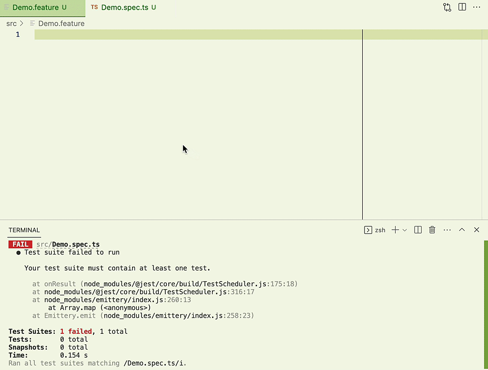

# Quick Gherkin Tests

> The most simple Gherkin possible.
> Use your favorite test runner.
> Zero regular expressions.
> Code ready to copy and paste.



It is time to stop using complex regular expressions and
wondering which is the best name for our step functions.
With Quick Gherkin Steps you will be able to quickly use
gherkins with minimal effort while avoiding gerkins.

See [examples](./examples) for more details.

## Demo

Feature file:

```feature
Feature: Magic of Disappearing Cucumbers

    Scenario: Eating 5 out of 12 cucumbers
        Given I have 12 cucumbers
        When I eat 5 cucumbers
        Then I should have 7 cucumbers remaining
```

Initial test:

```ts
import { createFeatureFileTests } from "gherkin-genie";

createFeatureFileTests("./Demo.feature");
```

Error message:

```
 FAIL  demo/Demo.spec.ts
  ● Test suite failed to run

    There are missing steps. Please implement them:

    class MissingSteps {
      givenIHaveNCucumbers(number1: number) {
        throw new Error("Unimplemented");
      }

      whenIEatNCucumbers(number1: number) {
        throw new Error("Unimplemented");
      }

      thenIShouldHaveNCucumbersRemaining(number1: number) {
        throw new Error("Unimplemented");
      }
    }

      73 |   if (!missingSteps.length) return;
      74 |
    > 75 |   throw new Error(
         |         ^
      76 |     [
      77 |       "There are missing steps. Please implement them:",
      78 |       "",

      at verifySteps (src/createFeatureTests.js:75:9)
      at createFeatureTests (src/createFeatureTests.js:21:3)
      at createFeatureFileTests (src/createFeatureFileTests.js:21:3)
      at Object.<anonymous> (demo/Demo.spec.ts:19:23)

Test Suites: 1 failed, 1 total
Tests:       0 total
Snapshots:   0 total
Time:        0.16 s, estimated 1 s
```

Copy paste and fix implementation:

```ts
import { createFeatureFileTests } from "gherkin-genie";

class CucumberSteps {
  #count = 0;

  givenIHaveNCucumbers(count: number) {
    this.#count = count;
  }

  whenIEatNCucumbers(eaten: number) {
    this.#count -= eaten;
  }

  thenIShouldHaveNCucumbersRemaining(left: number) {
    expect(this.#count).toBe(left);
  }
}

createFeatureFileTests("./Demo.feature", [CucumberSteps]);
```

✨ Done!
